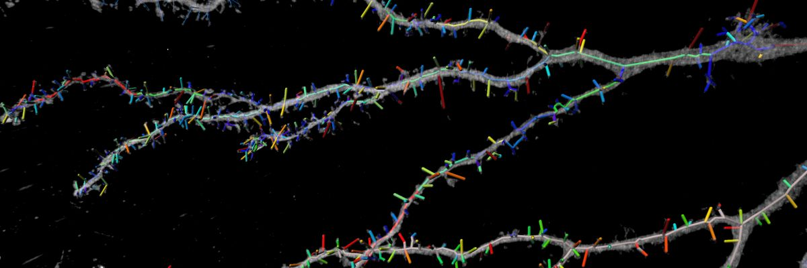

## Seg2dendrite:
#### Automatic 3D Dendritic Spine Quantification with ilastik and Imaris
---



Morse and Watson (Jonas group, unpublished)

### 1. Convert your images (.ims; or other) to .h5 for pixel classification in ilastik
---

Use the ImageJ macro `img2h5.ijm` to convert .ims files to ilastik .h5 files. Note,
that the `ilastik` update site needs to be enabled in Fiji.

Choose a folder with images and a filetype (e. g. .ims). If your data is stored in
multi-resolution, choose a resolution level (1: original resolution; 2 (default): down scaling by factor of 2).

### 2. Use ilastik pixel classificaiton
---

Use `Pixel Classification` workflow.
* Choose dendrite class as first class in training (yellow color)
* Make sure probability maps are exported as uint8 and renormalized to 0-255
Note, if the Pixel Classification workflow is not working with your data, try
the `Autocontext` workflow.

### 3. Convert probability maps to dendrite objects and save as .swc for import in Imaris
---
#### Command line tool:

Extract the dentritic spine skeletons graph from ilastik probability maps and export to .swc for import in Imaris

```
usage: seg2dendrite.py [-h] [-ms MIN_SIZE] [-rl RESOLUTION_LEVEL] [-s SMOOTH_SIGMA SMOOTH_SIGMA SMOOTH_SIGMA]
                       [-t THRESHOLD]
                       ilastik_h5 [ilastik_h5 ...]

Extract the dentritic spine skeletons graph from ilastik probability maps and export to .swc for import in Imaris

positional arguments:
  ilastik_h5            ilastik probability map(s), if not single channel the 1st channel is used. Data type must be
                        8-bit

optional arguments:
  -h, --help            show this help message and exit
  -ms MIN_SIZE, --min_size MIN_SIZE
                        Minimum object size in pixel
  -rl RESOLUTION_LEVEL, --resolution_level RESOLUTION_LEVEL
                        Resolution level used
  -s SMOOTH_SIGMA SMOOTH_SIGMA SMOOTH_SIGMA, --smooth_sigma SMOOTH_SIGMA SMOOTH_SIGMA SMOOTH_SIGMA
                        Smooth probability maps before thresholding. Gaussian sigma in px for ZYX
  -t THRESHOLD, --threshold THRESHOLD
                        Probability map threshold in range [0,1].
```
#### Jupyter:
See Jupyter notebook file

### 4. Import results to Imaris
---

####
Install the [.swc importer](./imaris_swc_impex) as a Imaris Python extension.

#### Example:
After pixel classification with ilastik on resolution level 2, which created a probability map volume_Probabilities.h5, use

```
python seg2dendrite.py volume_Probabilities.h5 --smooth 0.5 1 1 --threshold 0.5 -min_sizes 12000 --resolution_level 2
```

it will smooth the probability map with sigma ZYX of 0.5 x 1 x 1 and threshold at probability 0.5, filter dendrite objects for minimum size of 12000px.

### Dependencies (pip-installable)
Python >3.6
* h5py
* skan
* numpy
* networkx
* skimage
